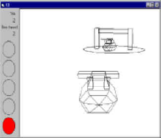

## I'm gonna keep doing this till I win code of the month : 3D Boat racers\!

### Description

This game took me about 2 hours. Its fun and addictive, I think, and it runs fast on a 166mhz pc. You'll wanna slow this down abit, I expect. Race the evil Boris the nasty in this racing game, maybe the first or secnod such game on VB planetsourcecode. Anyway, its got to be the first 3D racer, and you can make a better one, just by downloading my 3D engine, my 3D model maker, and using your imagination and abit of VB code. Resspect
 
### More Info
 

             |
---                |---
**Submitted On**   |2001-07-21 18:07:56
**By**             |[DeadFred](https://github.com/Planet-Source-Code/PSCIndex/blob/master/ByAuthor/deadfred.md)
**Level**          |Beginner
**User Rating**    |4.7 (191 globes from 41 users)
**Compatibility**  |VB 6\.0
**Category**       |[Graphics](https://github.com/Planet-Source-Code/PSCIndex/blob/master/ByCategory/graphics__1-46.md)
**World**          |[Visual Basic](https://github.com/Planet-Source-Code/PSCIndex/blob/master/ByWorld/visual-basic.md)
**Archive File**   |[I'm gonna 232157212001\.zip](https://github.com/Planet-Source-Code/deadfred-i-m-gonna-keep-doing-this-till-i-win-code-of-the-month-3d-boat-racers__1-25286/archive/master.zip)

